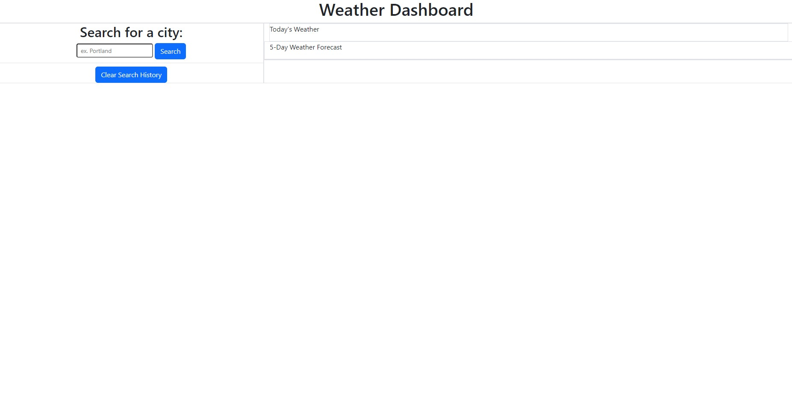
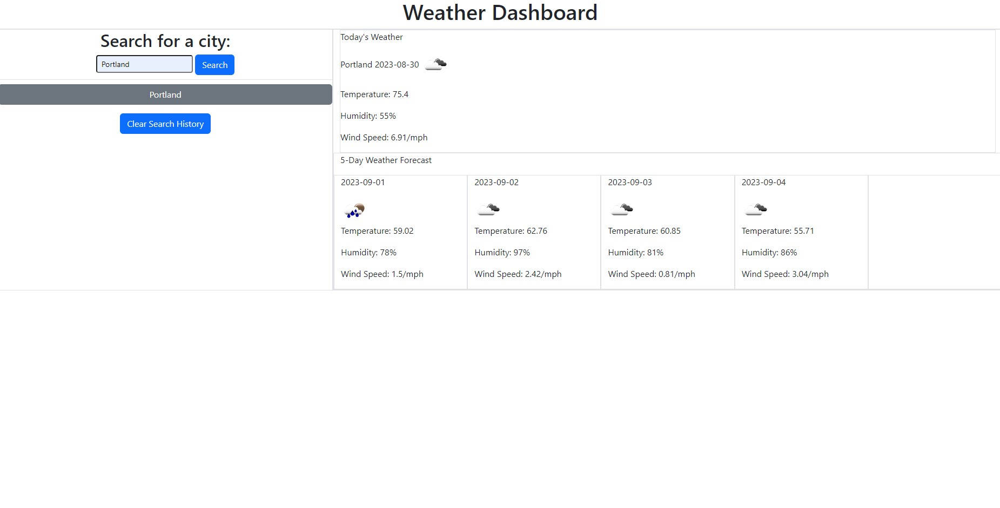

# Weather Dashboard

## Description

Traveling is one of the most popular hobbies among anyone you meet. Lots of planning is involved: checking the weather, making an itinerary, checking how much money you will be spending, etc. Out of all of these factors, the least controllable one is the weather for any given day. We are at the mercy of nature, and often times, we have to plan our trips around the weather. To help combat this issue, I have developed a simple weather-forecast search application that tells you the current weather of a city and the weather within that city for the next five days. With the help of OpenWeatherMap's free API's, it gives you information on weather such as the temperature, wind speed, humidity, and weather conditions.

Through creating this program, I gained more experience in traversing data provided from API's that are called upon and how to manipulate them to give me the information that I am looking for.

## Usage

Here is what the website looks like upon first visiting it: https://abrentis.github.io/Weather-Dashboard/

When you search for a city, both the current weather forecast and 5-day weather forecast will display:

See how new buttons appear on the left. These are recent search results of cities. You can press on these new buttons to revisit the weather for a city you previously searched.

## License

MIT License (please refer license file in GitHub repo for more information)